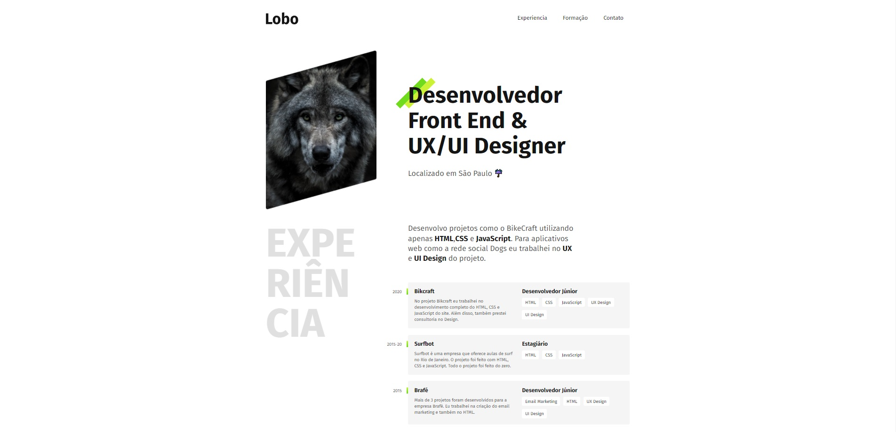

# 🐺 Portfolio Desenvolvedor

## WELCOME! 👋

  
 
This is a challenge proposed during the course at [Origamid](https://www.origamid.com/),
This is a Project developed to improve my skills with HTML and CSS concepts.
It was developed with semantics and accessibility in mind, using the best practices, where I was able to learn a lot more about this concepts!
 

  

## Technologies Used 🧩

- HTML5
- CSS3
- FlexBox
- Media-queries
- CSS Grid Layout
- Responsive Website
    

---

  Made with 💜&nbsp; by  Leandro Rodrigues

